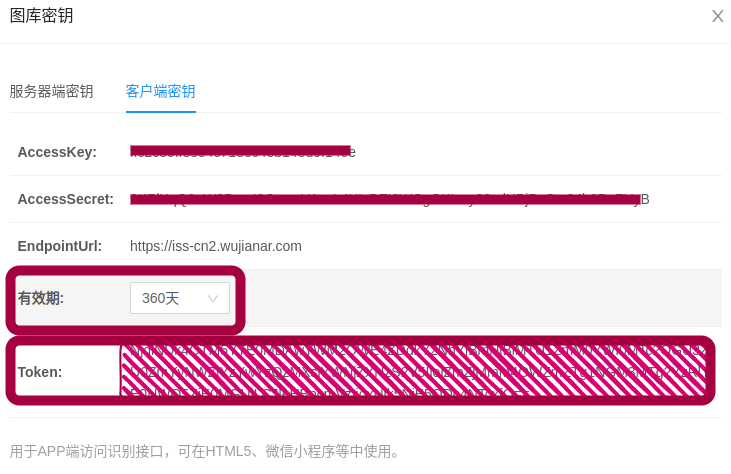
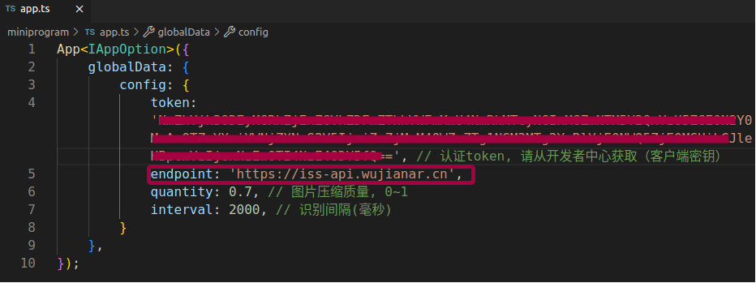

# 无间WebAR 微信小程序

技术支持：无间AR

官网: https://www.wujianar.com

技术支持QQ群：722979533

支持在微信小程序中识别，并能跟踪播放视频与渲染3D模型


# sample说明

下载地址： https://github.com/wujianar/wujianar-wx-mini-sample

sample可直接运行，无需修改。

# 开发说明

## 准备无间云识别库

登录[wujianar.com](https://www.wujianar.com)。

申请或购买一个云识别库


选择一个云图库，点击“管理”


点击“上传识别图”


sample中用到的识别图及关联信息如下：


```json
{"videoUrl":"https://wujianar-cdn.oss-cn-hangzhou.aliyuncs.com/ardemo/videos/2.mp4"}
```


```json
{"modelUrl":"https://wujianar-cdn.oss-cn-hangzhou.aliyuncs.com/ardemo/models/kl.gltf","scale":0.07}
```

## 获取token

点击“查看密钥”


点击“客户端密钥”，选择一个有效期，将 Token 复制出



## 准备微信开发者工具

下载“微信开发者工具”：https://developers.weixin.qq.com/miniprogram/dev/devtools/download.html

获取“AppID(小程序ID)”，如果没有，请注册微信公众平台账号：https://mp.weixin.qq.com/；
或申请测试账号：https://developers.weixin.qq.com/miniprogram/dev/devtools/sandbox.html

## 导入 sample


## 配置信息更新 (miniprogram/app.ts)

更新 config.token 为复制的 Token



## 在微信开发者工具上点击“预览”

注：开发工具上不能体验，请使用真机


# 常见问题

## 1. 屏幕上看不到模型

请打开调试功能，查看是否有错误；
请使用gltf格式模型，或调整模型大小。

## 2, 域名不在合法域名列表中

wujianar.com是未备案域名，不能加入到合法域名列表中，请使用你的域名代理到iss-cn2.wujianar.com，或请与技术支持联系。